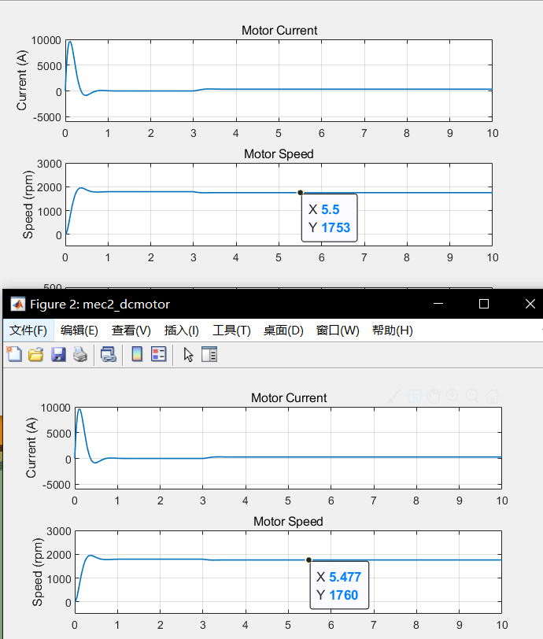
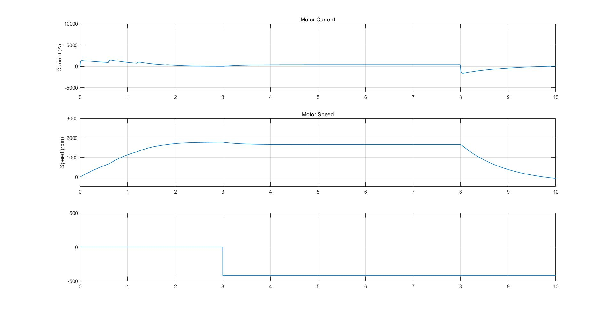

20 Percent Load Of Torque
===
The rated output torque is about 407 N/m.  
The no-load speed is 1789 rpm.  
n = -0.095823T + 1789  
While T = 325.6  
n = 1757.8  
The rotate speed difference between the rated torque and 80 percent of torque is `7.8 rpm`.  
In the simulink, the rated rotate speed is 1753 and the speed with 80 percent of torque is 1760 thus the difference is about 7.  

Start And Brake
===
I adopted the methods of staged start-up with 3 resistances and dynamic braking.
See it in the following chart.  

