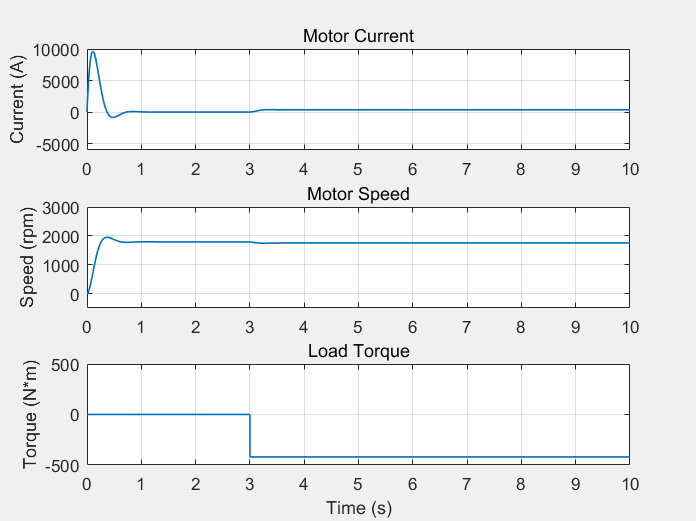
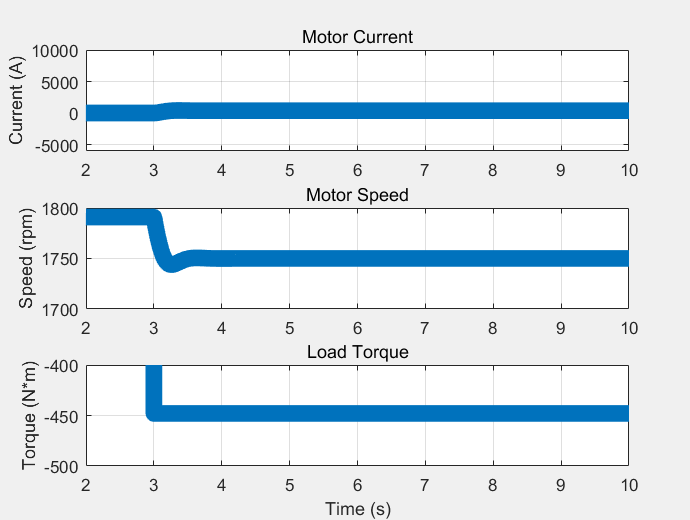
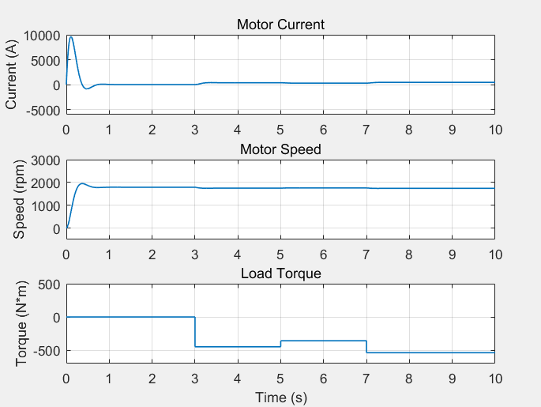
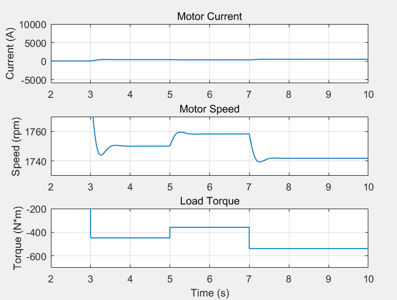
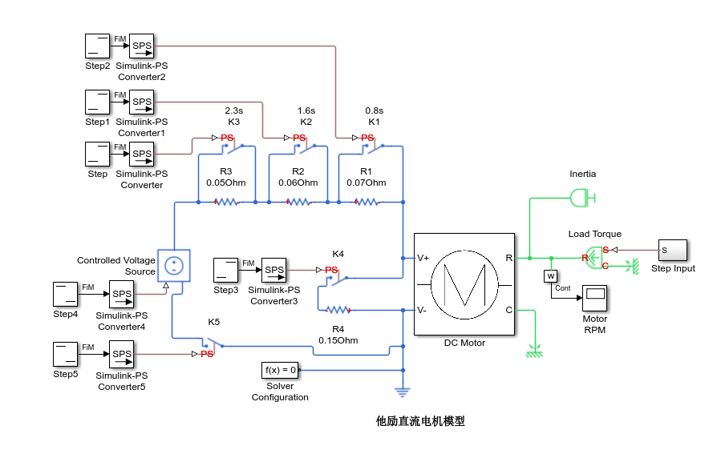
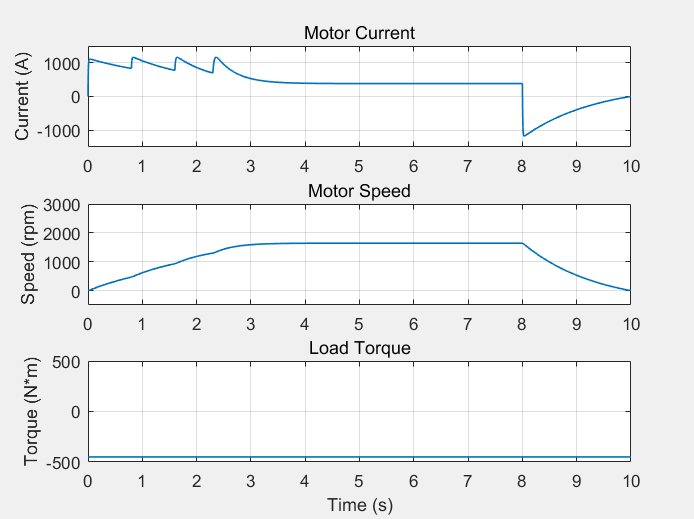
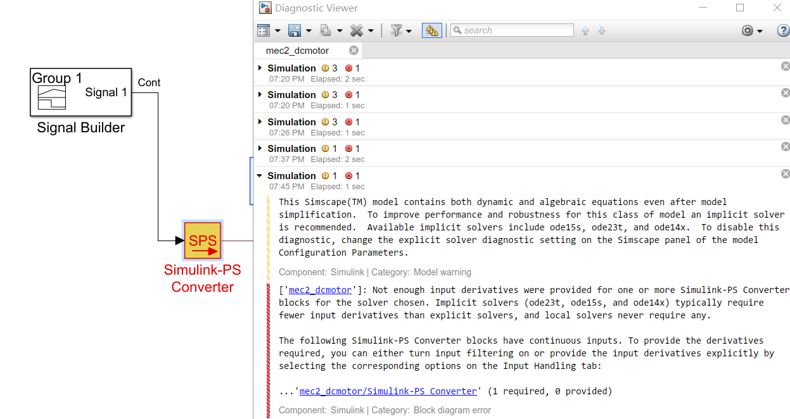

# 原始仿真
原始仿真图片如下  
  
# 额定转矩与测试
电机额定转矩为450kg/m2，测试图片如下 
  
使转矩分别增加20%和减少20%，得到仿真结果如下 
  
局部放大图如下  
  
电机转速分别为1742rpm和1758rpm  
# 启动与制动
我使用了三段串电阻式启动方式和能耗制动方式，负载为全程450rpm。电路图如下  
   
## 启动
我使用了0.07Ω，0.06Ω，0.05Ω三个电阻串接启动，分别在0.8s，1.6s，2.3s三个时刻被短路  
## 制动
我使用了0.15Ω的电阻作为外接电阻，在8s断开电源并且将此电阻接入电路  
相关仿真如下  
   
得到最大正向电流为1166A，最大反向电流为1177A  
# 相关分析
这种启动方式不太好反接制动，相对而言能耗制动较为方便，在尽量满足时间要求的前提下保证电枢电流尽量小。  
也可以使用多个电阻串联制动。  
# 总结与不足
使用可控电压源进行降压启动和反接制动的过程中遇见了一个较为罕见的bug，所用时间太长而且仍未解决，如图所示  
  
>我已经知道上面的问题出在哪里并解决了，可是没时间再做仿真了  
