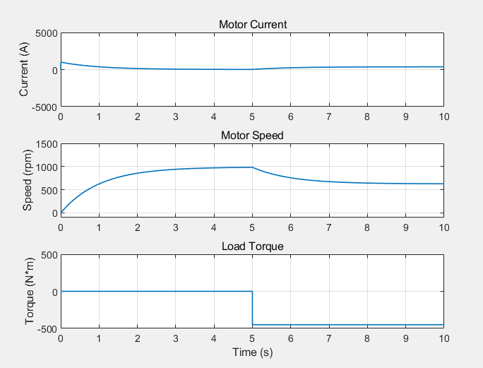

# 双闭环调速系统算法仿真  
## 电流源速度比例控制  
在采用理想可调电流源的基础上，采用速度比例积分控制采用纯比例P控制，选择合适的比例增益和积分增益，得到较为理想的阶跃响应曲线。比较该阶跃响应与仿真作业2的理想阶跃响应的差别。电路图如下  
  
由仿真得知Kp越大时，阶跃响应越理想，且加负载时转矩越接近理想转速。下图分别为Kp=1，8时的仿真  
  
  
显然Kp=8时较为理想
## 电压源双闭环比例积分控制  
用电压源+PI控制器构造更接近真实的电流环，代替理想可调电流源，调整电流环的PI控制器增益和速度电流环增益，获得较为理想的阶跃响应曲线，与单闭环阶跃响应曲线、理想电流源的阶跃响应曲线进行对比，电路图如下  

经仿真得当电流环增益Kp=0.003，Ki-0.01，速度环增益Kp=0.005，积分增益Ki=0.45阶跃响应较为理想，如下图  
   
对比知，经过调整后，超调量基本为0，负载从0加到额定负载时速度变化也较小，达成的效果基本一致；单闭环阶跃响应曲线稳定速度不会因负载增大而下降，理想电流源阶跃响应曲线和双闭环阶跃响应曲线皆有下降，但是可以通过调整增益改变这种情况。  
