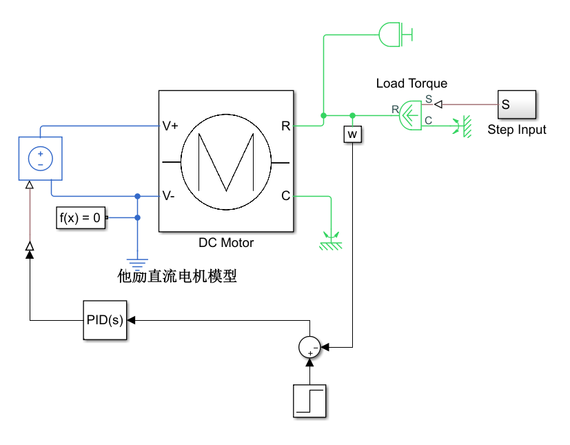
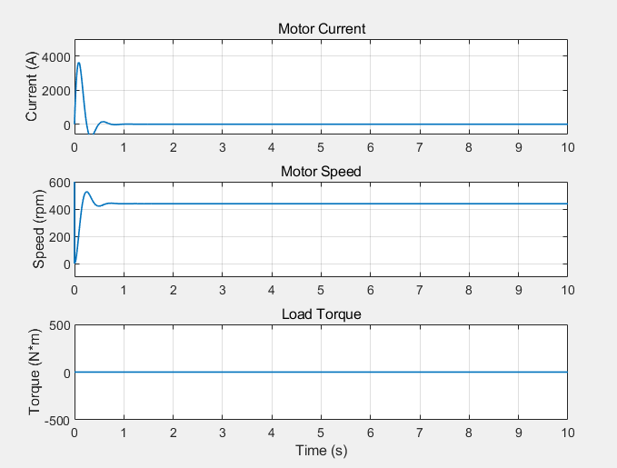
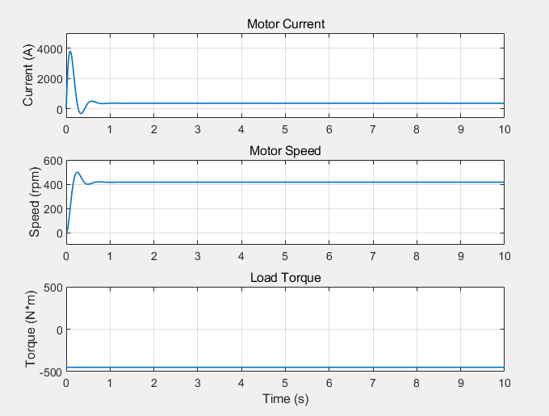
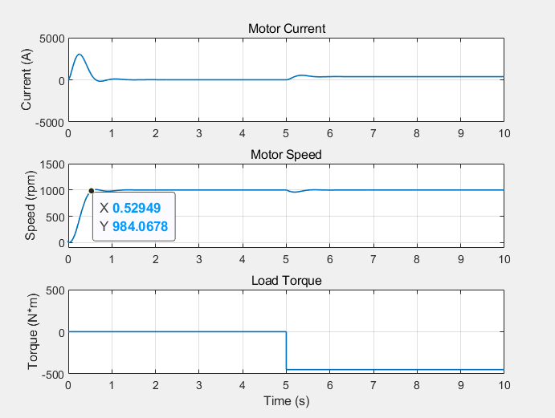

# 电路图  
电路图如下，为方便直接使用了PID控制器  
  
# 单闭环调速系统算法仿真  
## 纯比例积分P控制
当Kp为0.0001时速度阶跃超调量也有9%，无法下调至5%，且转矩太小无实际意义，故Kp1不参与讨论  
Kp2＝0.1005时，空载时速度阶跃超调量为20.00%，稳定转矩439.04rpm，速度静态误差为56.1rpm，如下图　　
  
额定负载时阶跃超调量为20.07%，稳定转矩为415.93rpm，速度静态误差为58.4%％，如下图　　
  
## 比例积分PI控制  
采用比例积分PI控制，选择合适的比例增益和积分增益，得到较为理想的阶跃响应曲线，记录比例增益Kp和积分增益Ki，并根据阶跃响应曲线记录超调量和过渡过程时间。观察电机从空载到加额定负载转矩时速度的变化过程  
如下图，比例增益Kp=0.005，积分增益Ki=0.45时阶跃响应曲线较为理想，超调量为0.91%，过渡过程时间约为5.3s 
 
